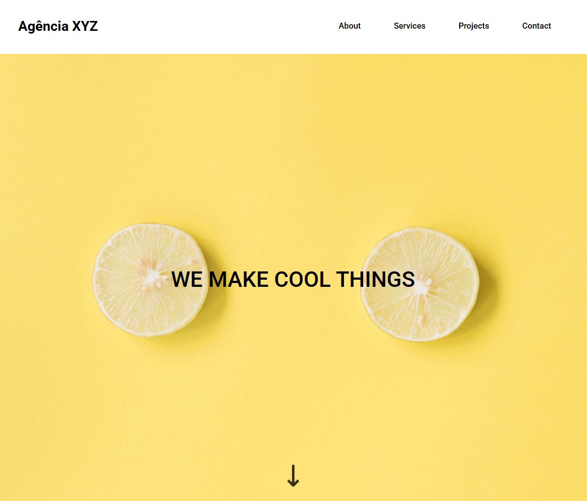
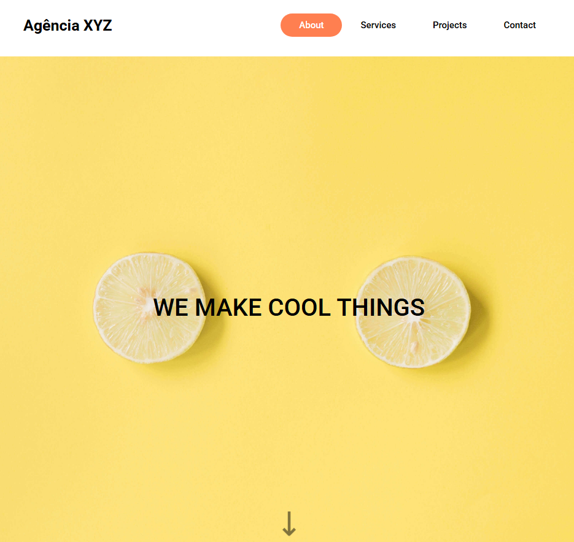
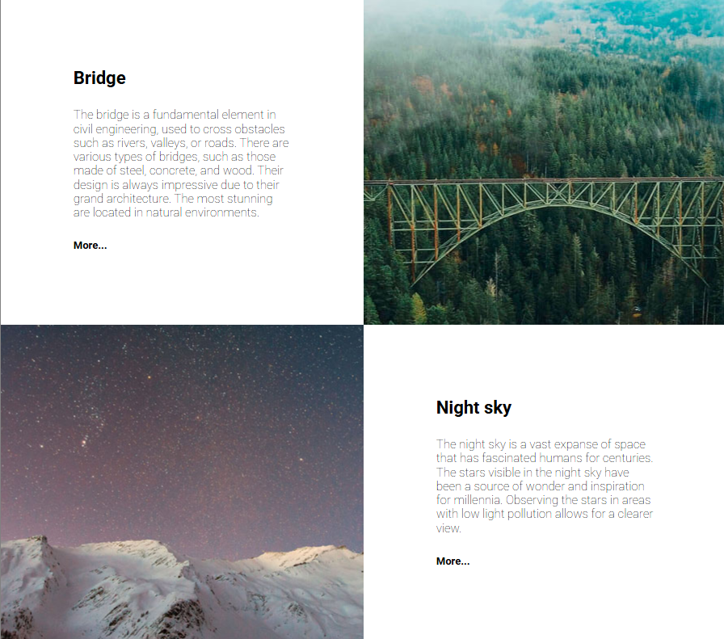
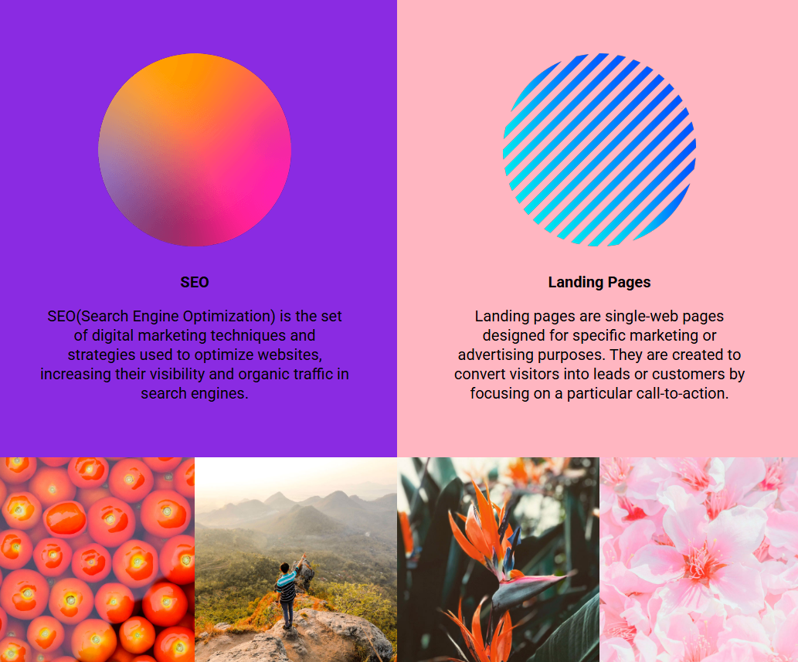
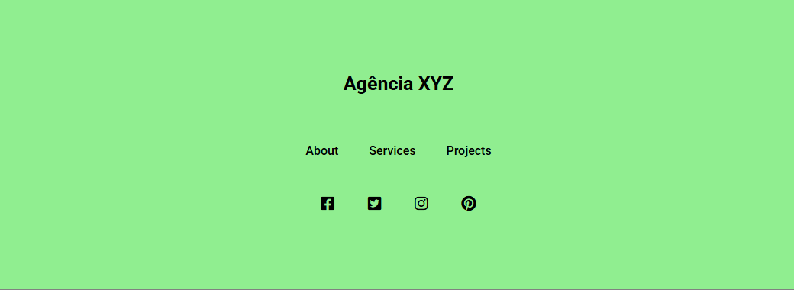
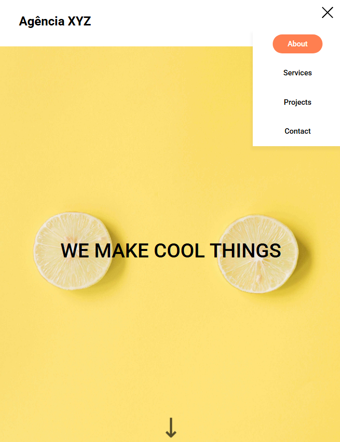
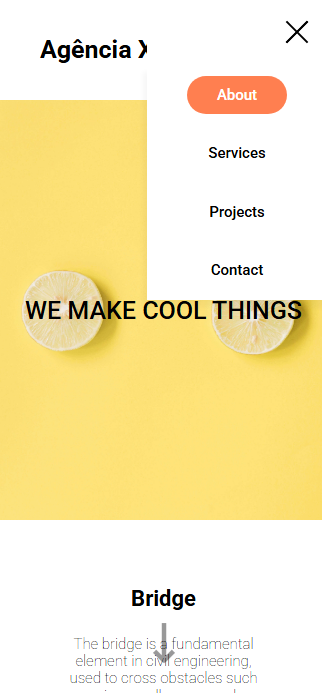

# Landing Page - Agência XYZ

Este projeto é o resultado de um exercício do módulo de HTML e CSS, proposto pelo curso DevQuest.

## Visão Geral 

###  Projeto 

 O objetivo é desenvolver uma página de uma agência de marketing digital com estrutura do tipo Landing Page (header, main, section e footer). Esse modelo de layout que é utilizado para apresentar um produto, serviço ou empresa de forma clara. 

###  Desafio

 O desafio consiste em desenvolver uma página a partir dos designs fornecidos, com estrutura do tipo Panding Page, dividida em header, sections (hero, about, services, contact), e um footer. A página é responsiva, se adaptando a diferentes tamanhos de tela, e inclui interações nos botões do menu.

### Funcionalidades 
<ul>
<li>Interação de hover nos botões do menu e ao clicar ir para a seção correspondente.</li>
<li>Responsividade para diferentes tamanhos de tela.</li>
</ul>

### Layout 

- <strong>Header:</strong> 
Cabeçalho com nome e um menu de navegação para as sessões da página.

- <strong>Hero Section:</strong> 
 Conteúdo que fica visivel quando acessa a página. 

- <strong>Sections - About, Services e Projects: </strong>
Sessões com informações sobre a agência.

- <strong>Footer:</strong>
  Rodapé com outro menu de navegação e links para redes sociais.

### Capturas de tela 

*Preview - Desktop:   
  
 

Preview - Desktop com interações:   
  

*Preview - Sections:
  
About Section:
  
  

Services e Projects Sections:
  
  

Footer: 
  
  
  

*Preview - Tablet:   
  
   
*Preview - mobile:   
  
  
### Links 
 
<ul>
<li><a href="https://github.com/fernanda-nunes/landing-page-agencia-xyz" target="_blank"> Repositórios</a></li>
<li><a href="https://fernanda-nunes.github.io/landing-page-agencia-xyz/#about" target="_blank"> Site ao vivo</a></li>
</ul>
 

## O que eu aprendi 

<b> Durante o desenvolvimento deste projeto, tive a oportunidade de consolidar e expandir minhas habilidades em desenvolvimento front-end.
